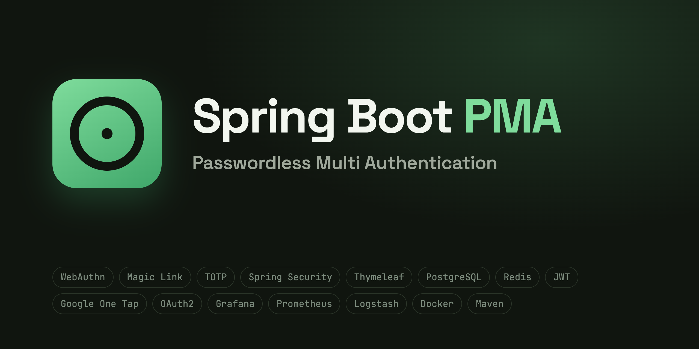

<p align="center">
  
</p>

<p align="center">
  <b>One Spring Boot server, two client surfaces, zero passwords.</b><br>
  Session-based web with CSRF and a stateless JWT API — each behind its own <code>SecurityFilterChain</code>.
</p>

<p align="center">
  
  
  
  
  
</p>

<p align="center">
  
  
  
  
  
</p>

<p align="center">
  <a href="#-what-is-this">What is this</a> ·
  <a href="#-first-run">First run</a> ·
  <a href="#-logging-in-web">Web login</a> ·
  <a href="#-logging-in-api">API login</a> ·
  <a href="#-project-structure">Structure</a> ·
  <a href="#-monitoring">Monitoring</a> ·
  <a href="#-documentation">Docs</a> ·
  <a href="#-known-limitations">Limitations</a>
</p>

---

## 🟢 What is this

Most Spring Security examples pick one lane: a Thymeleaf app with form login,
*or* a stateless REST API with JWT. Real products need both at once — a
browser UI **and** a mobile/API client — and the interesting problems live in
the seam between them. This repository is that seam, built out fully.

There is no password column anywhere. Sign-in, on both surfaces, is:

| Method | 🌐 Web (session) | 📱 API (JWT) |
|---|---|---|
| ✉️ **Magic link** (e-mail) | ✅ | ✅ deep-link callback for mobile |
| 🔢 **E-mail OTP** | ✅ | ✅ |
| 🕐 **TOTP** (authenticator app, QR enrolment) | ✅ | ✅ |
| 🇬 **Google Sign-In** (One Tap / OIDC) | ✅ | ✅ token exchange |
| 🐙 **GitHub OAuth2** | ✅ | ✅ token exchange |

Around the authentication core: Redis-backed distributed rate limiting,
account lockout with audit events, GeoIP impossible-travel alerts, EN/DE/TR
i18n on both surfaces, and a full local observability stack (Prometheus,
Grafana, ELK) that starts with one script.

## 🚀 First run

You need exactly two things installed:

| Requirement | Why |
|---|---|
| **Docker** (with compose) | Runs PostgreSQL, Redis and Mailpit for you — nothing else to install |
| **JDK 25** | The app itself (`./mvnw` downloads Maven automatically) |

You do **not** need a local Redis, Postgres or mail server — the containers
provide all three.

```bash
git clone https://github.com/ersincivi/spring-boot-passwordless-multi-auth.git
cd spring-boot-passwordless-multi-auth

# 1. Configuration — the dev profile ships with safe local defaults,
#    so an empty copy is enough to start
cp .env.example .env

# 2. Infrastructure: postgres + redis + mailpit
./start-dev.sh

# 3. The app
./mvnw spring-boot:run
```

Open <http://localhost:8585>. The dev profile seeds two accounts —
`admin@example.com` (ADMIN) and `user@example.com` (USER) — with no
passwords, because nothing here has one.

> 💡 Google/GitHub login needs OAuth client keys in `.env` — optional, every
> other flow works without them. Spring does not read `.env` by itself, so
> after filling in values export them first:
> `set -a; source .env; set +a; ./mvnw spring-boot:run`.
> See [`.env.example`](.env.example) for the full annotated list.

## 🌐 Logging in (web)

1. Go to <http://localhost:8585/login> and enter `admin@example.com`.
2. Choose **magic link** or **OTP** — either way an e-mail is sent.
3. The mail never leaves your machine: open **Mailpit** at
   <http://localhost:8025>, the message is already there.
4. Click the link (or type the code) — you are in.

TOTP can then be enrolled under **Settings** (QR code for any authenticator
app); after that, logins ask for the 6-digit code as a second factor. The
whole loop — including lockout after repeated bad codes and the rate-limit
counters — works offline against the containers.

## 📱 Logging in (API)

The same flow, as copy-paste `curl`. Full reference:
[`docs/api-authentication.md`](docs/api-authentication.md).

**1. Request a magic link**

```bash
curl -X POST http://localhost:8585/api/auth/email-magiclink/send \
  -H "Content-Type: application/json" \
  -d '{"email": "admin@example.com"}'
```

**2. Grab the token** — open Mailpit (<http://localhost:8025>) and copy the
link from the mail. It points at `/api/auth/verify?token=...`.

**3. Verify it.** This endpoint answers with a `302` redirect to the mobile
app scheme, carrying a one-time code:

```bash
curl -i "http://localhost:8585/api/auth/verify?token=PASTE_TOKEN_HERE"
# Location: passwordless://auth/callback?code=ONE_TIME_CODE
```

**4. Exchange the code for tokens** (code is single-use, 60 s TTL):

```bash
curl -X POST http://localhost:8585/api/auth/exchange \
  -H "Content-Type: application/json" \
  -d '{"code": "ONE_TIME_CODE"}'
# → { "data": { "token": "eyJ...", "refreshToken": "..." } }
```

**5. Call the API:**

```bash
curl http://localhost:8585/api/auth/me \
  -H "Authorization: Bearer eyJ..."
```

**6. Refresh when the access token expires** (refresh tokens rotate —
each one is single-use):

```bash
curl -X POST http://localhost:8585/api/auth/refresh \
  -H "Content-Type: application/json" \
  -d '{"refreshToken": "..."}'
```

Active JWTs are tracked in Redis (`jti` allow-list), so `POST
/api/auth/logout` and admin revocation take effect immediately — not
"valid until expiry". If the account has TOTP enabled, step 3 redirects with
`status=totp_required` and `POST /api/auth/totp/verify` takes the 6-digit
code instead.

## 🏗 Project structure

```
src/main/java/io/github/ersincivi/passwordless/
├── config/          SecurityConfig (the two filter chains), OpenAPI, metrics
├── controller/
│   ├── web/         Thymeleaf pages (login, settings, admin, geo-verify)
│   └── api/         REST controllers (/api/auth, /api/users, /api/roles …)
├── security/        JWT filter, token store, magic-link filter
├── service/         MagicLink · OTP · TOTP · JWT · lockout · rate limit ·
│                    GeoIP anomaly · e-mail queue · audit
├── domain/          JPA entities (User has no password field)
├── repository/      Spring Data JPA
└── bootstrap/       Dev-profile demo data
```

The heart of it is `config/SecurityConfig.java`: an `apiFilterChain` matched
on `/api/**` (stateless, JWT, no CSRF) and a `webFilterChain` for everything
else (Redis-backed sessions, CSRF, security headers). Neither chain's
authentication mechanism is reachable from the other's routes — that
separation is the point of the project.

## 📊 Monitoring

```bash
./start-fullstack.sh   # app infra + Prometheus + Grafana + ELK
```

| Tool | URL | |
|---|---|---|
| Grafana | <http://localhost:3000> | pre-provisioned auth & JVM dashboards |
| Prometheus | <http://localhost:9090> | scrapes `/actuator/prometheus` (Bearer token) |
| Kibana | <http://localhost:5601> | structured security-event logs, ready-made queries |
| Mailpit | <http://localhost:8025> | every outgoing mail, locally |

Details, custom metrics and the grok patterns:
[`docs/monitoring.md`](docs/monitoring.md).

## 📚 Documentation

| Document | Contents |
|---|---|
| [`docs/api-authentication.md`](docs/api-authentication.md) | Every REST endpoint with request/response examples — auth flows, users, roles, authorities |
| [`docs/openapi.json`](docs/openapi.json) | OpenAPI 3 spec (31 endpoints) — import into Postman/Insomnia |
| [`docs/monitoring.md`](docs/monitoring.md) | Prometheus, Grafana, ELK — what runs where and how to read it |
| [`docs/local-email-testing.md`](docs/local-email-testing.md) | How Mailpit replaces a real mail account in development |

## ⚠️ Known limitations

Stated here because a reader will find them anyway:

- **Test coverage is thin for the size of the codebase:** 24 tests against
  ~29,000 lines of Java. The tests that exist target the riskiest parts
  (token store, refresh rotation, rate limiting, method security, geo
  anomaly), but coverage is nowhere near proportional.
- **No schema migrations.** JPA `ddl-auto: update` manages the dev schema;
  Flyway/Liquibase would be mandatory before any production use.
- **No CI pipeline.** Builds and tests run locally only.
- **One controller is far too large:** `SecurityEnhancedController` is ~6,100
  lines and should be split by feature.
- **Session and JWT lifetimes are tuned for demo convenience,** not for a
  production threat model.

## 📄 License

[MIT](LICENSE). GeoLite2 databases are distributed under MaxMind's own
license and are not included in this repository.
